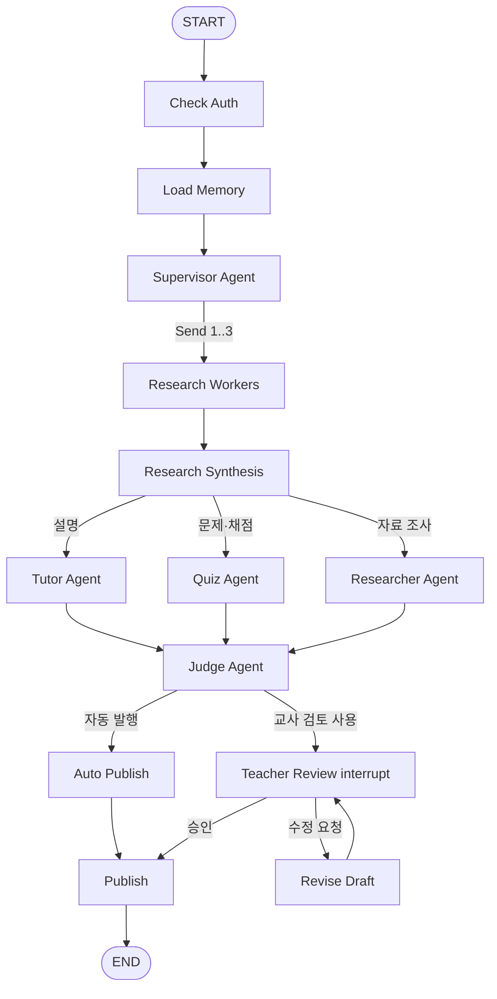

# Trinity RAG Assistant

LangGraph로 만든 수학 Education Agent입니다. 질문 의도를 분류하는 Supervisor와 Tutor, Quiz, Researcher 전문 에이전트가 협업하고, repo-local RAG 자료를 이용해 학생별 설명·퀴즈·자료 조사를 제공합니다. 기본 채팅 인터페이스는 Streamlit으로 실행합니다.

## 구현 범위

이번 Advanced Features 과제의 Option A, B, C를 모두 한 그래프에 적용했습니다.

### Option A: 멀티 에이전트

- `Supervisor Agent`: 자동 모드에서 질문 의도를 판별하거나 사용자가 고른 모드를 따릅니다.
- `Tutor Agent`: 학생 프로필과 검색 근거를 반영한 Feynman식 설명을 만듭니다.
- `Quiz Agent`: 객관식 문제를 만들고 같은 `thread_id`의 다음 답변을 채점합니다.
- `Researcher Agent`: 여러 자료에서 찾은 내용과 출처를 정리합니다.
- `Judge Agent`: 답변의 구조, 근거, 학습 활동, 접근 범위를 평가합니다.

### Option B: 워크플로우 아키텍처

- Prompt Chaining: `Research Synthesis -> Specialist -> Judge -> Publish` 순서로 각 단계의 결과를 다음 단계가 사용합니다.
- Parallelization: LangGraph `Send` API로 여러 RAG 검색 worker를 fan-out합니다.
- Orchestrator-Workers: Supervisor가 질문, 전문 에이전트, 수강 권한에 따라 매 요청마다 1~3개의 검색 작업을 동적으로 만듭니다.
- Conditional Routing: Supervisor가 Tutor, Quiz, Researcher 중 하나로 라우팅하고, 교사 검토 사용 여부와 승인 결과에 따라 후속 경로를 선택합니다.

### Option C: 테스트

- PyTest 노드 테스트: Supervisor 라우팅, 동적 worker 계획, Public/Premium 접근 경계를 독립적으로 검증합니다.
- 통합 테스트: Tutor, Quiz 생성·채점, Researcher의 교사 검토 중단·수정·승인을 끝까지 실행합니다.
- AI-as-judge: 외부 모델 설정이 있으면 구조화된 평가를 실행하고, 설정이 없거나 호출에 실패하면 로컬 rubric으로 안전하게 전환합니다.
- Streamlit 테스트: 앱 로딩과 실제 채팅 한 턴을 `streamlit.testing`으로 검증합니다.

## 그래프 구조



## RAG와 메모리

- `data/`의 Markdown/JSON을 Tool로 읽는 file-RAG입니다.
- 수강생은 Premium 자료, 비수강생은 Public 자료만 검색합니다.
- 검색 파일명은 allowlist로 제한해 임의 경로 접근을 막습니다.
- `MemorySaver`가 같은 `thread_id`의 질문 기록과 진행 중인 퀴즈를 유지합니다.
- 교사 검토를 켜면 LangGraph `interrupt()`에서 멈추고 `Command(resume=...)`로 승인 또는 수정합니다.

## 실행 방법

Python 의존성은 `requirements.txt`에 정리되어 있습니다.

```bash
uv run --with-requirements requirements.txt streamlit run streamlit_app.py
```

브라우저에서 표시되는 주소로 접속한 뒤 자동, 튜터, 퀴즈, 자료 조사 모드를 선택할 수 있습니다. 기본값은 별도 API 키 없이 끝까지 동작하는 로컬 judge입니다.

CLI 데모에서는 Tutor, Quiz 생성·채점, Researcher와 교사 검토 흐름을 차례로 실행합니다.

```bash
uv run --with-requirements requirements.txt python agent.py
```

노트북으로 확인하려면 `qna_tutor_agent.ipynb`를 열어 셀을 순서대로 실행합니다.

## AI judge 설정

실제 외부 AI judge를 사용하려면 실행 환경에 다음 이름의 변수를 설정합니다. 값은 저장소에 기록하지 않습니다.

- `OPENAI_API_KEY`
- `EDUCATION_AGENT_JUDGE_MODEL`

두 변수가 모두 설정된 경우에만 Streamlit의 외부 AI judge 토글이 활성화됩니다. 외부 호출이 실패하면 예외 종류만 기록하고 로컬 평가로 전환합니다.

## 테스트와 검증

```bash
uv run --with-requirements requirements.txt pytest -q
python3 -m py_compile agent.py streamlit_app.py
jq empty qna_tutor_agent.ipynb
bash -n init_and_push.sh
git diff --check
```

## 포함된 자료

- `data/premium_lecture_transcripts.md`
- `data/premium_textbook_metadata.md`
- `data/public_exam_solutions.md`
- `data/public_concept_notes.md`
- `data/curriculum_standards.md`
- `data/student_profiles.json`
